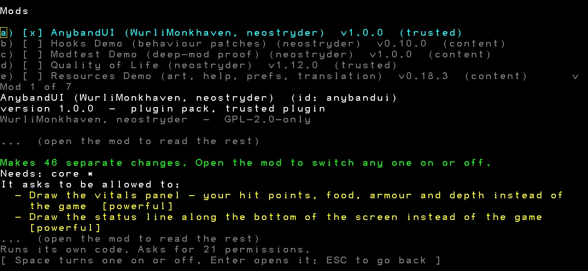

# AnybandUI for Neo Angband

A mouse-first desktop interface for [Neo Angband](https://github.com/neostryder/neo-angband), ported from [AnybandUI](https://github.com/WurliMonkhaven/AnybandUI), the Angband frontend by Wurli Monkhaven.

AnybandUI started as a native Windows frontend for vanilla Angband, aimed at people who have never played a game in a terminal. It gives the game panels you can dock anywhere, a quickbar on the number keys like the one in World of Warcraft, tooltips on everything, an equipment comparison table, a store window with your pack beside the stock, a spell table with aim previews, and optional CRT and dungeon effects. This mod brings that interface to Neo Angband, where it runs in the browser and the desktop app alike.

## Status

Version 1.0.0 brings over the interface itself: panels, the map under the mouse, items, spells and the quickbar, stores, layout, and effects. Each feature has its own switch on the mod's options page, and every switch starts off, so you turn on only what you want. The main menu, character creation, touch and controller play, and a bridge to the native AnybandUI client come in later releases, as [PLANNED.md](PLANNED.md) describes.

## What it changes, and what it leaves alone

AnybandUI changes how the game looks and how you reach its commands. The rules stay the game's own: rolls, prices, knowledge checks and save files work exactly as they do without the mod. The panels show only what the game already tells you, with one exception you have to turn on yourself, Glow shows hidden magic, which lights up unidentified artifacts, hidden curses and unknown runes on the floor. Every command still works from the keyboard with its usual key, and turning the mod off brings the standard interface back unchanged.

The effects (CRT scanlines, item glows, sleeping-monster marks, the presence haze around uniques) are each a separate setting, and each can be turned down or off.

## Features

| Area | What you get |
| --- | --- |
| Layout | Each card is a pane in the game's own window layout, so it docks, tabs, resizes, floats and hides like the game's subwindows. Add the panes you want from Subwindow setup on the options menu. |
| Status | A character card with HP and SP bars, food, XP, stats, gold, armour and speed. A one-line status bar shows effects, depth, light, the level feeling and the terrain underfoot, and the message bar shows the newest message. |
| Map | Hover a tile for what you know about it, click to walk or attack, right-click for a menu of actions on that tile, a gold path while aiming, and zoom and pan. |
| Quickbar | Thirty slots on the number keys, with Shift and Ctrl rows, for spells, potions, scrolls, wands and activations, showing mana cost or charges on each slot. |
| Items | Searchable pack, equipment and quiver lists, the game's full description of the selected item, action buttons, a comparison table for gear, and your ignore settings and inscriptions. |
| Stores | Store stock and your pack side by side, with prices, descriptions, the comparison table, and buttons that go through the store's own quantity and price questions. |
| Spells | Every book's spells with mana, fail rate and status in one table. Cast or study with a click, answer the game's own aiming question, and see the blast footprint while aiming. A rest dialog offers the game's rest choices. |
| Effects | CRT screen treatment, a low-health tint, the death burst, glows on floor items, rising z marks over sleeping monsters, a haze around uniques, and combat rings. Each has its own switch and a strength setting, and all of them respect the system's reduced-motion setting. |

## Installing

AnybandUI is on the recommended list on the in-game Mods screen. Install it there, enable it, then open its options to turn on the features you want. It needs Neo Angband 1.20.0 or later.

## Working on it

The repository root is the mod folder. `manifest.json` and `plugin.js` are what the game fetches, and `plugin.js` is built from `plugin.ts` and `src/` by `pnpm build`.

Run `pnpm install`, then `pnpm verify`, which typechecks, runs the tests, and fails if the committed `plugin.js` is older than its source.

Contributions arrive as pull requests from a fork, including from the co-authors. Open an issue first for anything larger than a fix, so the work lines up with a phase in [PLANNED.md](PLANNED.md). Issues filed here are moved to the [main Neo Angband tracker](https://github.com/neostryder/neo-angband/issues) under the `repo:mod-anybandui` label, where every mod's issues live.

## Releasing

Each release bumps `manifest.json` and `package.json` together, dates its section in `CHANGELOG.md`, and is tagged `vX.Y.Z` on `master`. The tag is what an install pins itself to.

## Licence

GPL version 2. See [LICENSE.md](LICENSE.md).

## Credits

Created by **Wurli Monkhaven** ([WurliMonkhaven](https://github.com/WurliMonkhaven)), whose AnybandUI design, layout and effects this mod ports, and **neostryder**, who maintains Neo Angband. The full list is in [CREDITS.md](CREDITS.md).
